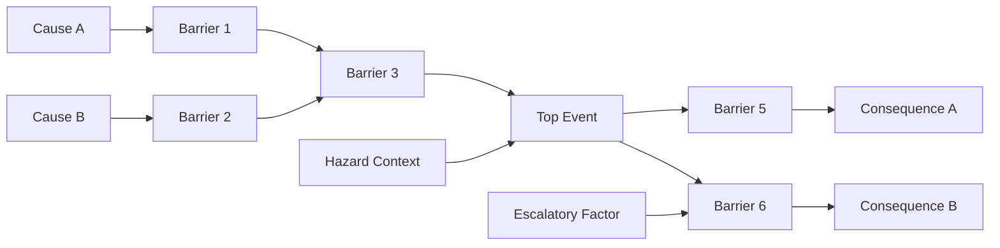

# Bowties
A python module for modelling bowties in [PyMC](https://www.pymc.io)

## What are Bowties?

[The UK Civil Aviation Authority guide to Bowties](https://www.caa.co.uk/Safety-initiatives-and-resources/Working-with-industry/Bowtie/About-Bowtie/Introduction-to-bowtie/)

## Bowtie Structure

